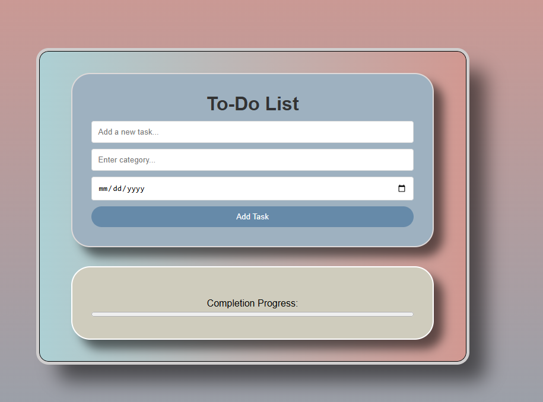

# To-Do List

This is a simple **To-Do List Web Application** that helps you organize your tasks effectively. You can add tasks, assign categories, set due dates, track progress, and mark tasks as completed.

## Features:

- **Add Tasks**: Easily add new tasks with categories and due dates.
- **Mark Tasks as Complete**: Keep track of completed tasks with a progress bar.
- **Delete Tasks**: Remove tasks when they are no longer needed.
- **Progress Tracker**: See how many tasks are completed with a live progress bar.
- **Empty State Alert**: Displays a message if there are no tasks in the list.
- **Auto-Refresh**: Automatically refreshes when tasks are completed.
- **Category Sorting**: Organize tasks into categories for better management.
- **Time Tracking**: Displays how much time is left until the task is due.
- **Responsive Design**: Works across all devices.

## How to Use:

1. **Open the Website**: 
   Open the `index.html` file directly in your browser. No installation or setup is required.

2. **Add a Task**: 
   - Type your task in the input field.
   - Choose a category (optional).
   - Select a due date.
   - Click the **"Add Task"** button to add it to the list.

3. **Manage Tasks**:
   - **Mark Complete**: Click the **Complete** button to mark a task as done.
   - **Delete Task**: Click the **Delete** button to remove a task.

4. **Track Progress**:
   - As you complete tasks, the progress bar updates.
   - If all tasks are completed, the progress bar shows 100%.
   - Deleting all tasks resets the progress bar to 0%.

5. **View Categories**:
   - If there are no tasks in a category, it will display "No tasks for this category."

## Customization:

You can personalize the app by editing the `style.css` file:
- Change task card outlines (e.g., `border-left` or `border-right`) for categories.
- Update progress bar colors.
- Adjust button or font styles to match your preferences.

---

## Example Screenshot:
Here is how the To-Do List Web App looks:

Enjoy using the To-Do List Web App! 😊 
